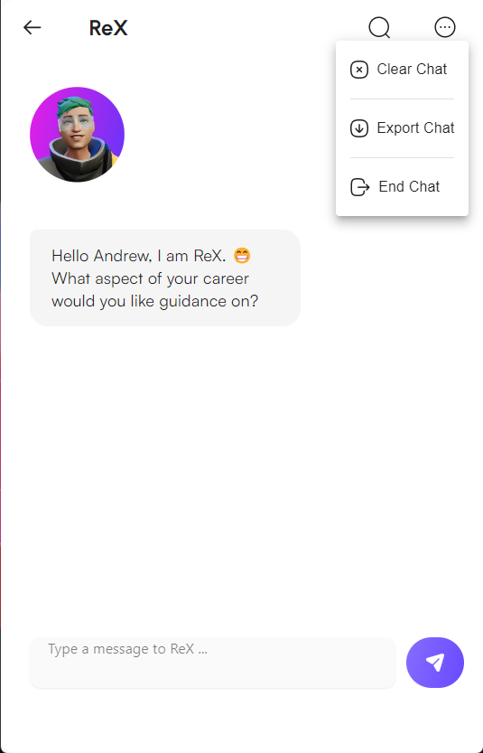

# CosmoChat UI

## Description
CosmoChat UI is a state-of-the-art chat interface designed to enhance online communication through a seamless and interactive user experience. Built using advanced frontend technologies such as React and Redux, it incorporates OpenAI's GPT technology to offer intelligent, automated responses, enriching user interaction. Key features include real-time message delivery, customizable user themes, and a responsive layout. By integrating with OpenAI, CosmoChat UI aims to transform standard messaging into dynamic conversations, ensuring messages are not just exchanged but are also engaging and insightful.

## Screen Shots

### Welcome Page

### Home Page

### Chat Window with openAI response

### Ended Chats List

### Chat Menu

### Delete Button on Home Page

### Activity Page

## Tools used
React.JS, Material UI, Framer Motion, Axios, Open AI. 

## Acknowledgement 
Special Thanks to my mentor Billy Bett for helping me get through my blockers and RadicalX CEO Talha Sabri for this opportunity. 

## About RadicalX

RadicalX is pioneering an immersive digital world designed specifically for Gen Z developers.# Cosmochat
